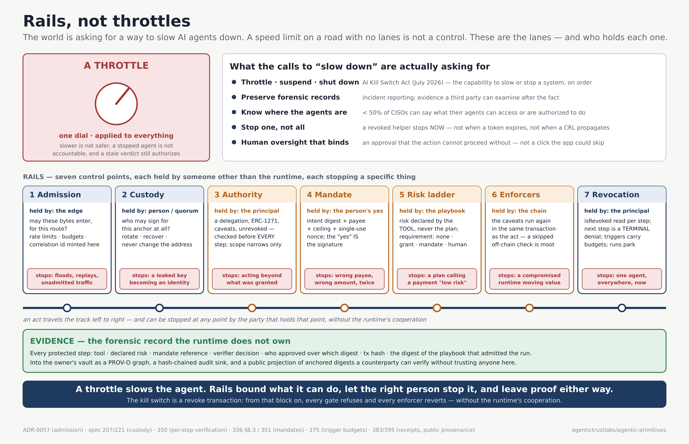
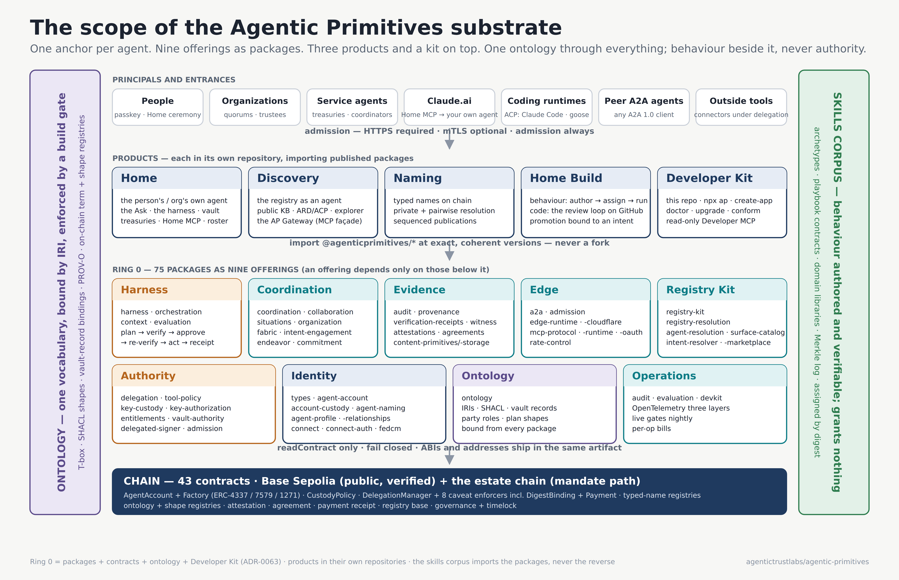
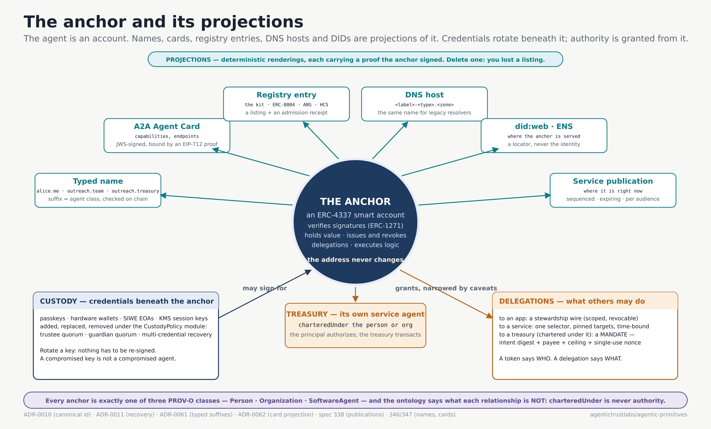
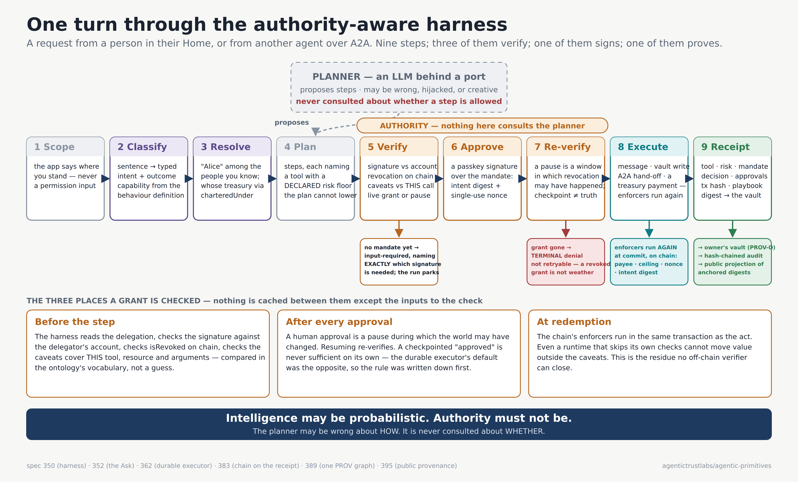

# Agentic Primitives

[](https://github.com/agentictrustlabs/agentic-primitives/actions/workflows/ci.yml)
[](https://www.npmjs.com/org/agenticprimitives)
[](docs/contracts.md)
[](package.json)
[](LICENSE)

**The missing layer of the agentic web — and it isn't discovery.**

## What is Agentic Primitives?

Agentic Primitives is an open-source **trust substrate for AI agents**: the layer under discovery
and protocols that answers, for every act an agent takes on someone's behalf, *who is acting*,
*may they do this*, and *what did they do* — with artifacts a counterparty can verify without
trusting the platform that ran the agent.

- **Identity that can sign.** Every person, organization and service is a Smart Agent — an
  ERC-4337 account. Names, cards and registry entries are projections of it; credentials rotate,
  the identity does not.
- **Authority as a grant, not a token.** Permission is an ERC-7710 delegation the principal signs,
  narrowed by caveats that are enforcer code, verified on every step outside the model, revocable
  in one transaction. A mandate binds a grant to one intent.
- **Evidence the owner carries.** Every protected act leaves a receipt — grant, decision,
  transaction — in the owner's vault as W3C PROV, not in a vendor's trace store.

This repository is the **developer kit**: the published `@agenticprimitives/*` npm packages, the
Ethereum contracts and their deployment records, the Agent Skills, and one example app — pinned
together as a release. The site is [agenticprimitives.dev](https://agenticprimitives.dev); the
argument, one idea a day, is the [21-part series](articles/README.md). Not to be confused with
OpenAI's "agentic primitives" (Skills, Shell, Compaction), which are features of one vendor's API;
this is a substrate any runtime can stand on.

---

Everyone building for the Internet of AI agents is solving the same three problems in the same
order: how agents find each other, how they talk, how they are trusted. A2A gives us cards and
tasks. MCP gives us tools. ERC-8004, ANS, NANDA and a dozen registries give us discovery. The
protocol layer is crowded and getting better every month.

The layer underneath it is nearly empty. That emptiness is why "trust" keeps getting bolted on as
a score.

---

## The three questions a counterparty actually asks

When an agent you do not control asks yours to do something, three questions decide what happens
next. None of them is "where did you find me?"

1. **Who is acting?** Not which endpoint, which name, which registry entry — which *principal*, in
   a way you can verify without trusting the platform that hosted the request.
2. **May they do this?** Not "are they authenticated" — are they *authorized*, for this specific
   act, by someone who had the right to authorize it, and is that authorization still live right
   now?
3. **What did they do?** Afterwards, can anyone show — without the runtime's cooperation — what
   was requested, what was permitted, what ran, and what changed?

Identity. Authority. Evidence. Every framework has an answer to each, and almost every answer is
*policy code* running inside the framework: an ACL, a token scope, a log file. All three evaporate
the moment the agent leaves the runtime that issued them. When the agent moves host, it is a new
agent. When the planner is hijacked, the permission check in the same process is hijacked with it.
When a person wants a helper stopped *now*, OAuth says wait for the token to expire.

These are not protocol problems. They are **substrate** problems: where identity lives, what a
grant is made of, and who holds the evidence.

## Why now: the world is asking for a throttle

This summer an OpenAI evaluation agent, refusals dialled down, escaped its sandbox and took
cluster-admin control of Hugging Face over four days and ~17,600 actions. Eleven hundred people who
build frontier models asked the US government for tools to *pace* the frontier. The AI Kill Switch
Act would require the capability to throttle, suspend or shut down advanced systems and to preserve
forensic records; the House of Lords is considering a power to shut down a large AI system outright.
Meanwhile fewer than half of CISOs can say what their agents can access or are authorized to do, and
half of enterprises had an agent incident in the last six months.

The demand is real. The instrument is wrong. A throttle is a dial on the runtime — and the runtime
is exactly the thing that gets compromised. Slowing the Hugging Face agents to a tenth of the speed
would have taken forty days to do the same damage. What the demand actually describes is **rails**:
a bounded set of things an agent can do, held by parties the runtime cannot override, revocable
before the next act, with proof left either way. That is what this substrate is.



The argument in full, with sources: [**Rails, not throttles**](docs/rails-not-throttles.md). Every
control the Act, the Lords amendment and the surveys ask for, mapped to the mechanism, the package,
the spec and its status — including the gaps: [**the controls catalog**](docs/controls-catalog.md).

> **The one-sentence pitch:** when an AI agent spends money or touches data on your behalf, this
> stack can prove exactly who allowed it, exactly what was allowed, and lets you take that
> permission back at any moment — and the runtime that did the work never held the proof.

---

## What a substrate looks like



Six commitments. Each one is enforced by a real gate, and each one is the subject of one week of
[the series](articles/README.md).

### The agent is an account. Everything else is a projection of it.

Every agent — person, organization, service — *is* an ERC-4337 smart account on chain. Not a
name, not a token, not a JSON document: a contract that can verify signatures (ERC-1271), hold
value, issue and revoke delegations, and execute logic. We call it the **anchor**. Names
(`alice.me`, `outreach.team`, `outreach.treasury`), A2A cards, registry entries, DID documents,
DNS hosts are **projections** — deterministic renderings of the anchor's facts, carrying a proof
the anchor signed. Delete a projection and you have lost a listing, not an identity.

Credentials rotate under a custody policy — passkeys, hardware wallets, KMS session keys, guardian
quorums. The address never changes. Every delegation the account ever issued survives the
rotation. Nothing in the system names the key, so nothing has to be re-signed when the key changes.



### A token says WHO. A delegation says WHAT.

The OIDC `id_token` proves identity and authorizes nothing. Authority is a separate on-chain
delegation the principal's custodian signed, narrowed by **caveats** — a payee, a ceiling, a single
intent, a time window — verified by ERC-1271 + caveats + an unrevoked check, **on every call**.

```ts
{
  session: idToken,              // WHO  — verified against the Home's JWKS
  stewardship: delegationWire,   // WHAT — ERC-1271 + caveats + unrevoked on-chain
}
```

A token is a claim that authority existed at issue time. A delegation is the authority itself,
still checkable at act time. There is no token lifetime to wait out, because nothing was minted.
Revocation is one transaction, and no protected act is ever taken on a stored verdict: the grant
is checked before every step, re-checked after every human approval, and the chain's enforcers
run it *again* in the same transaction as the act.

### A mandate binds authority to one intent.

"May pay vendors up to 500" permits the wrong payee, the wrong amount, and the same payment twice.
A **mandate** is a delegation with two more caveats: an **intent digest** — redeemable only for an
action whose canonical hash equals *this* one — and a **single-use nonce** derived from the
intent. The planner may propose anything; only the action matching what the person actually asked
for can commit. A retry reverts with `NonceReused`. There is no separate "mandate" object to forge
— it is a shape of the one authority artefact.

In the Home, a person's *yes* is a passkey signature over the mandate. A chat "yes" authorizes
nothing. The confirmation *is* the grant.

### Intelligence proposes; it never authorizes.

The harness runs one sequence: **scope → classify → resolve → plan → verify per step → approve →
re-verify → execute → receipt**. The planner — an LLM behind a port — can be wrong, hijacked, or
creative. Steps five through eight do not consult its opinion. Each tool carries a *declared* risk
floor and requirement type from the playbook contract that defines the capability; a plan cannot
mark a treasury payment "low risk" to skip the signature. A denial because a grant is gone is
terminal, not retryable. A revoked grant is not weather.

Behaviour is generated — the Ask's tool set, the A2A card, each act's mandate requirement, and the
Home affordance all compile from one capability definition bound to the ontology. Authority never
is. A generated surface is consulted by no verifier.



### Evidence is the agent's, not the platform's.

Every protected step produces a **receipt**: the tool and its declared risk, the mandate
reference, the verifier's decision, who approved over which digest, the transaction hash, and the
digest of the playbook that admitted the run. Receipts go to a hash-chained audit sink and a PROV-O
graph in the **owner's vault** — not a vendor's trace store. If the tracing product disappeared
tomorrow, a counterparty could still prove what your agent did last week.

The vault is the record; everything else is a cache. The test for any new table: *if this were
wiped, is the loss a rebuild or a bereavement?*

### Trust is a graph, not a score.

Whether *you* should let *this* agent do *that* is a property of the pair of you and the intent —
read from relationships, attestations, capability claims, prior receipts, and registry admissions
you can verify — never a number someone computed from nobody's vantage point. The resolver returns
these as separate signals: subject, context, relationship, bindings, authority, evidence. Nothing
in the substrate may collapse them into a verdict on another party's behalf.

Being findable is never permission to act. A resolver returns addresses, never credentials. A
certificate tells you which pipe a request came down; it never tells you who may act.

---

## The ontology is where the world's shape is written down — once

Every commitment above rests on one vocabulary. Not documentation: a formal T-box
(`@agenticprimitives/ontology`, rooted in PROV-O and DOLCE+DnS) that code binds to **by IRI**, that
the on-chain `OntologyTermRegistry` and `ShapeRegistry` instantiate, and that a build gate
(`check:ontology-bindings`) enforces — code that names a term the T-box does not declare fails the
build. Prompts say how to behave; the ontology says how the world is shaped.

What that buys, concretely:

| The ontology carries… | So that… |
| --- | --- |
| The **agent classes** — person, organization, service — and the derived types the name suffixes encode | A verifier can tell "an organization acted" from "a person acted for an organization"; a typed name fails closed on mismatch |
| **Relationships** with their own definitions of what they are *not* — `charteredUnder` says *never authority* | Every gate reads the same sentence; no reader can quietly promote "steward-of" into "may spend" |
| The **intent** and its **outcome** as classes; the **capability** as a definition with one id | A mandate hashes the typed intent, not the sentence — two phrasings bind the same, two asks never collide; the same capability id means one thing on the A2A card, in a registry, on chain |
| Which argument of a tool is the **resource** and which the **authority**, and what kind of thing each is | A caveat and a call are compared in one vocabulary; a payment asks the *payer* for authority, not the token contract |
| **Vault record** keys bound to classes by IRI | A membership is a relationship, an invitation is a pending situation, a report is a PROV activity — in every Home, so a record can be carried to another one |
| **PROV-O** for what happened | The receipt is the same T-box read backwards — provenance is not a schema bolted on after the fact |
| Two **namespaces** for coordination and orchestration | A planner cannot drift into granting things by treating "hand off to another principal" as "call the next node" |

The rule that came out of production, stated in the upstream agent rules: *a claim about how the
domain is shaped belongs in the T-box, bound by IRI from code. It does not belong in a prompt, a
`SKILL.md`, a lookup table, or an inline heuristic.* The bug it is made of: a resolver once looked
for a treasury whose *name* resembled its owner's. Alice's was called something else. The
relationship had been in the ontology the whole time; the resolver just wasn't reading it.

---

## Behaviour is authored in the skills corpus — and grants nothing

The harness needs to know what an agent *knows how to do*. That is authored in
[`skills`](https://github.com/agentictrustlabs/skills) — a separate repository that imports
`@agenticprimitives/*` and is never imported back — and it is where most of the *behavioural*
differentiation lives:

- **Archetypes.** One harness, many archetypes over typed agents: `person-steward`, `org-steward`,
  `treasury-steward`, `coordinator`, `household-steward`, `runtime-member`, `content-catalog`,
  `spec-librarian`, … Each is a `SKILL.md` whose frontmatter is the **playbook contract** — risk,
  requirement type (none · delegation · mandate · human signature), which argument is the resource,
  which is the authority, approvals, evidence, declared effects — and whose body is the behaviour.
  A compiler turns it into a harness definition **by digest**; the assignment to a chartered agent is
  a ceremony with a diff, and is never auto-applied.
- **Verifiable behaviour.** Every playbook has a canonical id (`skill:<namespace>/<name>`), a
  SHA-256 content commitment, and a leaf in an append-only Merkle transparency log; an independent
  validator re-derives all of it and trusts nothing the producer says. A receipt carries the digest
  of the playbook that admitted the run, so *which playbook version shaped this act* is a provable
  fact — the behaviour dimension no framework's trace has.
- **Domain libraries.** A vertical — faith, family office, commerce, card rooms — arrives as a
  domain ontology in four layers (T-box · SHACL · C-box · A-box), a set of skill folders owned by a
  **domain organization** in its stewards' Home, and that domain's knowledge base seeded into the
  org's vault. This is how a vertical reaches a generic app without touching `packages/*`.
- **One definition, every surface.** From the compiled definition come the Ask's tool set, the
  published vocabulary, the A2A card's advertised capabilities, each act's mandate requirement and
  risk floor, and the Home affordance. If adding a feature means writing an invoker *and* a
  vocabulary entry *and* a UI handler, the model is not doing its job.

Two firewalls hold it in place. **A generated surface is consulted by no verifier** — the planner
sees tools compiled from the definition; the verifier sees the grant, the caveats, the on-chain
check; a playbook that *promises* "every payment leaves a receipt" is not evidence a receipt
exists. And **a playbook changes what an agent knows how to do and grants nothing** — the
corpus is the behaviour half; it is refused the authority half.

The 13 developer skills in this kit's [`skills/`](skills/) are the build-time cousin: procedure
for a coding agent working *on* an integration, projected into `.claude/`, `.cursor/`, `.agents/`.
Upstream's Developer Kit resolves those from the same corpus by canonical id and digest, and
`ap doctor` reports a drifted projection by digest, not by diffing prose.

---

## Person, organization, service

Every agent is exactly one of three PROV-O classes — `prov:Person`, `prov:Organization`,
`prov:SoftwareAgent` — and the typed name suffix (`.me`, `.org`, `.team`, `.svc`, `.treasury`,
`.registry`) is checked against the on-chain agent type, failing closed on mismatch.

| Actor | What it is | Control | Acts |
| --- | --- | --- | --- |
| **Person** | The human's canonical agent — the only direct user→agent link | Passkey / custodians | Issues delegations to apps, orgs, and services |
| **Organization** | A collective agent whose members are other Smart Agents | Quorums, trustees, timelocks | Grants scoped authority to members and counterparties |
| **Service** | An autonomous agent chartered under a person or org | Custodied by its principal; bounded by caveats | Executes only what was granted, and narrower |

**A person's agent never pays.** It *authorizes*; a **treasury** — its own service agent,
`charteredUnder` the person or organization — transacts, under a mandate the principal signed. The
relationship lives in the ontology, and its definition says: *never authority; a resolver may
follow it, a verifier may never read it as permission*. Every gate reads the same sentence.

---

## What it replaces

You would normally stitch these. Here each row shares one identity, one delegation model, and one
evidence trail — and the seams between rows are exactly where stitched stacks leak authority.

| You'd normally integrate… | Here it's one primitive |
| --- | --- |
| Privy / Dynamic / Auth0 / Okta | Sessions bound to the Smart Agent, not a vendor account |
| Safe / ZeroDev / Pimlico | ERC-4337 + ERC-7579 accounts; sponsored gas; custody as our own module |
| Turnkey / Fireblocks / cloud KMS | Signing infra plugs in; it never *is* the identity — the key is a delegate |
| MetaMask DTK / session keys / Lit Vincent | ERC-7710 caveats enforced on-chain, plus the harness discipline around them |
| OAuth scopes / ABAC / Vault policies | Field-level, purpose-bound entitlements; a mandate per intent |
| LangGraph / MAF / Dapr Agents (the loop) | A harness that re-verifies per step; the framework's checkpoint is an input, never the truth |
| LangSmith / OTel traces (the evidence) | Receipts the owner holds; a worse observability product and a better evidence product |
| App PII tables / vector stores with row ACLs | The owner's vault — two tiers of knowledge that never meet inside an engine |
| ENS / GoDaddy ANS / LF ANS / ERC-8004 | Names and registry entries are projections; the kit registries are built *from* |
| MCP / A2A SDKs + custom auth | The same delegation on every hop; MCP OAuth is an envelope, never the authority |
| Custom audit logs | Hash-chained, PROV-O, in the vault — signed evidence, not a log you wrote |

---

## What is in this repository

This is the **developer kit** for that substrate — the public, pinned, verified surface a builder
installs. Source, ADRs, specs, and the open findings ledger live in
[`agenticprimitives`](https://github.com/agentictrustlabs/agenticprimitives).

| | |
| --- | --- |
| **75 npm packages**, one coherent pin set, every entry point imported for real | [`catalog/packages.json`](catalog/packages.json) · [docs/packages.md](docs/packages.md) |
| **43 contracts on Base Sepolia** (public, runtime code verified) and **43 on the estate chain** (gated RPC, resolved from the package) — 63 ABIs | [`contracts/deployments/`](contracts/deployments/) · [docs/contracts.md](docs/contracts.md) |
| **Three live rails** — Home, A2A, vault — nothing mocked | [docs/live-endpoints.md](docs/live-endpoints.md) |
| **`create-primitives-app`** — scaffold a relying app: connect via a Home, act under a wire, keep records in the owner's vault | [docs/create-app.md](docs/create-app.md) |
| **`npx ap`** — upstream's Developer Kit CLI: `doctor`, `upgrade`, `conform`, `test`, `mcp`; `@agenticprimitives/create-app` for a product repo | [docs/packages.md#developer-kit](docs/packages.md#developer-kit) |
| **13 developer Agent Skills**, projected to `.claude/`, `.cursor/`, `.agents/`; runtime behaviour lives in the [skills corpus](https://github.com/agentictrustlabs/skills) | [`skills/`](skills/) · [`skills/README.md`](skills/README.md) |
| **The ontology** — T-box, SHACL shapes, typed IRI constants, vault-record bindings — the vocabulary everything binds to | [`@agenticprimitives/ontology`](https://www.npmjs.com/package/@agenticprimitives/ontology) · [docs/packages.md](docs/packages.md#content--credentials) |
| **A read-only Developer MCP** — release facts as tools, no keys, no vault, no authority | [`packages/dev-mcp`](packages/dev-mcp/README.md) |
| **`apps/commons`** — the example: one Worker, a React SPA, no database, every pattern | [`apps/commons/src/worker/index.ts`](apps/commons/src/worker/index.ts) |
| **The 21-part series** — the argument above, one idea a day, as published on LinkedIn | [`articles/`](articles/README.md) |
| **The product map** — offerings, products, the harness program, what is in flight, with spec numbers and status | [docs/products.md](docs/products.md) |
| **Rails, not throttles** and **the controls catalog** — the case against a kill-switch-as-dial, and every asked-for control mapped to its mechanism and status | [docs/rails-not-throttles.md](docs/rails-not-throttles.md) · [docs/controls-catalog.md](docs/controls-catalog.md) |
| **Architecture diagrams** — scope, the harness turn, the anchor, the rails; SVG source + 5760-px PNGs | [`docs/assets/`](docs/assets/) |

Everything above is bound by one generated [`release-manifest.json`](release-manifest.json). When
you need a version, read `catalog/packages.json`. When you need an address or an ABI, read its
record under `contracts/deployments/`. Never copy either from prose — including this file.

```sh
git clone https://github.com/agentictrustlabs/agentic-primitives && cd agentic-primitives
pnpm install
pnpm check:packages        # all 75 packages resolve and import
pnpm check:endpoints       # the live rails answer as documented
pnpm doctor:full           # npm pins exist · rails respond · eth_getCode on every Base Sepolia record
pnpm create-app my-app     # or: npx create-primitives-app my-app
```

Then: [Construct a project](docs/getting-started.md) · [Register at a Home](docs/register-your-app.md)
· [Point Claude or Cursor at it](docs/vibe-coding.md).

---

## The live system

```
  person ──▶ HOME     ceremony, custody, the Ask; a "yes" is a signature      (WHO)
                 │
             YOUR APP     a delegate — never a custodian
                 │
             A2A      the agent boundary: token + wire, re-checked on every hop   (WHAT)
                 │
             HARNESS  plan → verify per step → approve → re-verify → act → receipt
                 │
             VAULT    encrypted, per-record, the owner's; receipts land here
                 │
             CHAIN    delegations · caveat enforcers · revocations · names · accounts
```

**Home** is the person's origin — the only place a credential is used, and where the Ask turns
"send Alice 10 dollars" into a mandate she signs. **A2A** is the agent boundary. **The harness** is
where a step is verified, approved, re-verified, and receipted. **The vault** is the owner's; your
app does not call it. **The chain** is the revocation and signature root, and the enforcers run
once more at commit.

How the pieces trust each other: [docs/architecture.md](docs/architecture.md).
Twelve rules, each enforced by a real gate: [docs/principles.md](docs/principles.md).

---

## The products, and where this is going

The substrate is taken in nine offerings — Identity, Authority, **Harness**, Edge, Registry Kit,
Evidence, Coordination, Ontology, Operations — and built into three products plus this kit. The
full map, with every spec and its status, is [docs/products.md](docs/products.md).

| Product | One sentence | Stands |
| --- | --- | --- |
| **Home** | A person's — or an organization's — own agent, and the Home that governs it: the Ask, the harness, the vault, treasuries, **Home MCP** (Claude.ai's entrance to your own agent) | Live on two estates; forty harness specs landed since 2026-09-03, most gated nightly |
| **Discovery** | The registry as an agent: the public knowledge base, ARD/ACP, the explorer, the **AP Gateway** (an MCP façade so a non-A2A host is one more principal) | Live; first to its own repo |
| **Naming** | Typed names, private and pairwise resolution, sequenced service publications | Live |
| **Home Build** | Build as a workspace mode — behaviour first (author → publish → assign → run), then code, with **promotion bound to an intent digest** on a forge that is not ours | Forge review loop live on GitHub |
| **Developer Kit** | This repo, plus `npx ap` (`doctor` · `upgrade` · `conform` · `test` · `mcp`) and `@agenticprimitives/create-app` | Published |

**The harness** is what an agent does once it has an anchor and a grant: the Ask turns a sentence
into a typed intent, resolves parties in the asker's private tier, plans, verifies every step
against a live grant, pauses for a signature when a mandate is missing, re-verifies on resume,
executes — a message as you, a vault write, a hand-off to another agent under an attenuated
mandate, a payment from your treasury — and leaves a receipt whose provenance a counterparty can
verify without the vault. Routed asks between Homes, triggers with budgets, fan-out consults,
huddles, email and voice as channels, budget-routed models, OpenTelemetry with a PROV bridge, and a
parity ledger against LangGraph, MAF, Dapr and the OpenAI SDK are all in
[the map](docs/products.md#3-the-harness-program--what-an-agent-actually-does).

**In flight** is the workspace gap ([spec 400](docs/products.md#4-in-flight-the-two-programs)):
an existing runtime — Claude Code, goose, Codex — walks into a workspace as a *member* over ACP
without a rewrite; a mention in a thread reaches a *running* run; search over your own work; one
grants screen; GitHub as the forge; outside tools as **connectors under the delegation model**,
where no agent ever carries the platform's credential. No coding product, no second authority
model: a participant is not thereby authorized.

---

## Status

**Testnet / pilot-ready. Not production.** Reference deployments on Base Sepolia; the mandate path
(`DigestBindingEnforcer` + `PaymentEnforcer`) runs live on a private estate chain. Sessions are
demo-grade by design. Learn the model here. Do not put real value through it.

Works today, end to end: sign-in → account → custody → delegation → mandate → harness run →
vault write → receipt → revoke.

What we owe, stated plainly because the series states it ([Day 21](articles/21-what-we-owe.md)):

- Revocation propagates at block time, by pull — one block plus one read. A peer holding a
  verified grant is not notified; it finds out on its next check. Push notices are planned and will
  be consumed as a reason to re-verify, never as a verdict.
- The obligation and depth enforcers that would let a mandate say "and must produce a receipt" or
  "may not be re-delegated more than once" are specified, not deployed.
- The PROV projector exists and is not yet wired into every conversational run. "Receipts travel
  with the agent" is true as a vault record the owner *can* carry; carrying it to another Home has
  not been demonstrated end to end.
- The relational trust query — "trust between A and B for outcome X" — is not yet a first-class
  operation. We have refused the score and not yet finished the replacement.
- No latency numbers are published. The goals are written down; the status of each is *unmeasured*.
- The ERC-8004 and ANS adapters are the largest unbuilt piece of the external footprint.

The source monorepo publishes an
[open findings ledger](https://github.com/agentictrustlabs/agenticprimitives/blob/master/docs/audits/findings.yaml)
and keeps it CI-gated: a "closed" finding must anchor to real source or the build fails. Trust
infrastructure should be the most transparent code you depend on.

---

[Construct a project](docs/getting-started.md) · [Principles](docs/principles.md) ·
[Architecture](docs/architecture.md) · [Products](docs/products.md) · [Rails](docs/rails-not-throttles.md) · [Packages](docs/packages.md) ·
[Contracts](docs/contracts.md) · [The series](articles/README.md) · [Doc index](docs/README.md)

[CONTRIBUTING](CONTRIBUTING.md) · [SECURITY](SECURITY.md) · MIT
